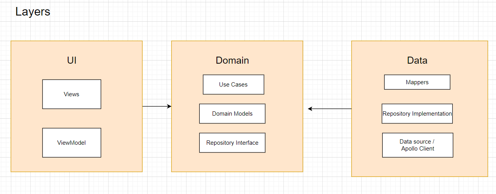
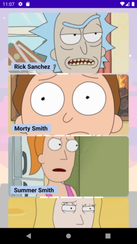
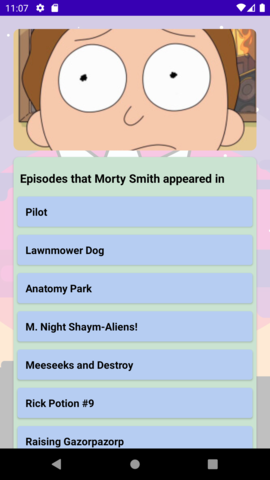

# About ApolloRickAndMorty
Hello there , 
In this project I tried showcasing how to build an Android Application with clean architecture and MVVM using some of the jetpack libraries with Kotlin Coroutines & Dagger Hilt. This App is using the [Rick and Morty GraphQl](https://rickandmortyapi.com/graphql) as a remote data source.    
This app is based on the [Guide to app architecture](https://developer.android.com/jetpack/docs/guide) article, [Kotlin 1.4](https://kotlinlang.org/docs/reference/whatsnew13.html), and [coroutine](https://kotlinlang.org/docs/reference/coroutines/basics.html). I also used some android architecture components like [LiveData](https://developer.android.com/jetpack/arch/livedata), [ViewModel](https://developer.android.com/topic/libraries/architecture/viewmodel).
I wrote [a medium article](https://medium.com/nerd-for-tech/graphql-with-apollo-android-why-its-worth-taking-a-look-f30ceb4a23ae) to talk about GraphQL and how to implement it in an android application, feel free to check it out.
# Project Architecture
### Communication between layers 
1. UI calls method from ViewModel.
2. ViewModel executes Use case.
3. Use case executes one or multiple Repositorie function.
4. The Repository returns data from one or multiple Data Sources(Remote-Rick and morty GraphQL , Local-Room DB). the repository is the single source of truth
5. Information flows back to the UI where we display the data fetched from data sources.

I made a diagram to show the flow of the data between the three layers(data, domain , presentation) 

# Project Structure
* Data
    * This is my data layer and consists of the Repository implementation class as well as the remote and local data sources and mappers
* Domain
    * This is the domain layer and consists of the domain models as well as the usecases.
* UI 
    * This is the presentation layer. I have set up packages by feature here. This consists of the view related code.
* DI
    * This is where Dagger related code lives , I wanted to try out Hilt and see what it can deliver.
* Utils
    * This is where most extension functions and constants. 

Libraries Used
---------------
* [ViewModel](https://developer.android.com/topic/libraries/architecture/viewmodel) - store and manage UI-related data in a lifecycle conscious way
* [LiveData](https://developer.android.com/jetpack/arch/livedata) - notify the view when data changes .
* [ViewBinding](https://developer.android.com/topic/libraries/view-binding/) - easily write code that interacts with view
* [Material](https://material.io/develop/android/docs/getting-started/) - Material Components.
* [Coroutine](https://github.com/Kotlin/kotlinx.coroutines#user-content-android) - performs background tasks
* [Flows](https://kotlin.github.io/kotlinx.coroutines/kotlinx-coroutines-core/kotlinx.coroutines.flow/-flow/) - for asynchronous data streams
* [Coil](https://github.com/coil-kt/coil) - An image loading library for Android backed by Kotlin Coroutines
* [Gson](https://github.com/google/gson) - JSON Parser
* [Apollo](https://www.apollographql.com/docs/android/)- GraphQL client for the JVM, Android and Kotlin multiplatform
* [Dagger Hilt](https://dagger.dev/hilt/) - dependency injector
* [Room](https://developer.android.com/training/data-storage/room) - Save data in a local database
* [Espresso](https://developer.android.com/training/testing/espresso/) // UI test
* [Barsita](https://github.com/AdevintaSpain/Barista) -UI tests Built on top of Espresso
* [Junit](https://junit.org/junit4/) // unit tests
* [Truth](https://github.com/google/truth) // Makes your test assertions and failure messages more readable

# Screenshots

